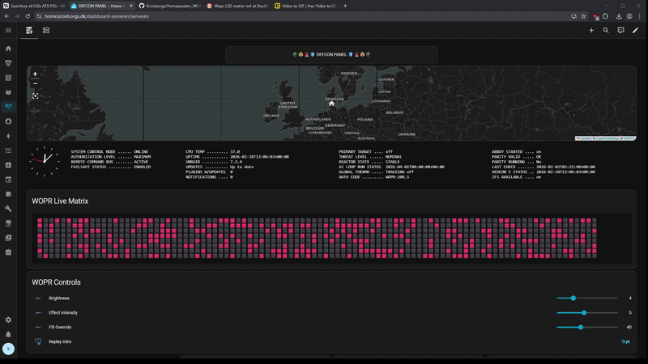
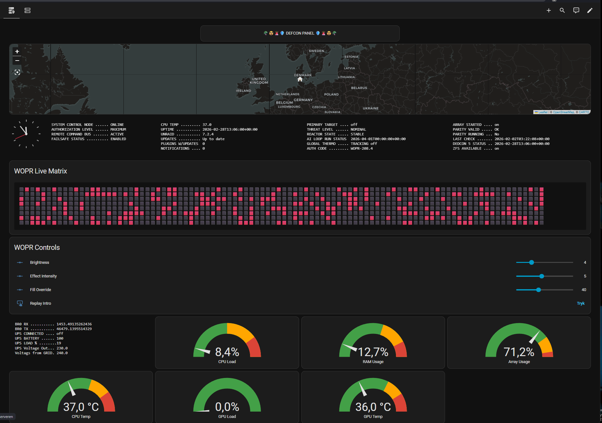
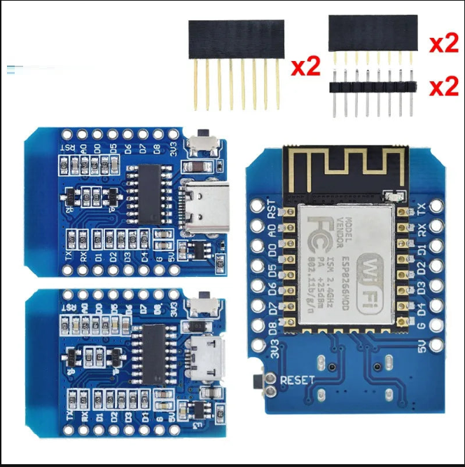

# W.O.P.R Rack Display (ESPHome + Home Assistant)

Et custom W.O.P.R-inspireret rack-display bygget med **ESP8266 (D1 Mini)**, **MAX7219 96x8 LED matrix**, **ESPHome** og **Home Assistant**.

Projektet kombinerer live netværksdata fra **UniFi** med statusdata fra **Unraid Management Agent** i et DEFCON-inspireret dashboard.

## Kredit

- 3D print rack-mount STL design: MakerWorld model af original skaber
  https://makerworld.com/en/models/1670433-rack-mounted-led-matrix-8x96-wopr-style?from=search#profileId-1768436

## Hvad projektet kan

- Viser en dynamisk W.O.P.R matrix på fysisk LED-panel (96x8)
- Matrixens aktivitet reagerer på:
  - Antal online klienter (UniFi)
  - WAN trafik/load (UniFi RX + TX)
- Har introsekvens: **"MY NAME IS JOSHUA, SHALL WE PLAY A GAME?"**
- Eksponerer live matrix-rækker til Home Assistant som tekst-sensorer
- Giver styring direkte i Home Assistant:
  - Brightness
  - Effect Intensity
  - Fill Override
  - Replay Intro
- Indeholder et komplet Home Assistant dashboard med:
  - WOPR Live Matrix (emoji-renderet)
  - WOPR Controls
  - Unraid server/array/parity/status visninger
  - Performance gauges (CPU, RAM, temperatur m.m.)

## Demo & billeder

Læg dine media-filer i mappen `docs/screenshots/` med præcis disse filnavne:

- `WOPR.gif` (Home Assistant demo)
- `01-dashboard-overview.png` (dashboard overview)
- `ESP-D1-mini-USB-c.png` (controller reference)
- `physical-rack-display.jpg` (foto af det rigtige display)

### Home Assistant demo (GIF)

### Dashboard overview

### ESP D1 Mini controller

### Physical rack display

## Hardware

- 1x ESP8266 D1 Mini
- 12x MAX7219 moduler (kædet) = 96x8 matrix
- Strømforsyning dimensioneret til matrix + ESP

## Indkøbsliste (ud over filament)

- 3x MAX7219 8x32 (4-in-1) dot matrix moduler
  https://www.amazon.de/dp/B07HJDV3HN?th=1
- Skrue-/møtrik-sortiment (M3/M4/M5/M6)
  https://www.amazon.de/dp/B0DQ16QCRW?th=1
- ESP32 Mini USB-C dev boards (3-pack)
  https://www.amazon.de/-/en/gp/product/B0D7V9591B?smid=AACU6YN8E2OJC&th=1

### Derudover skal du typisk bruge

- 5V strømforsyning med nok ampere til matrixen (gerne med lidt margin)
- Ledninger/jumper wires (Dupont) til signaler
- Strømkabler til 5V/GND distribution til alle paneler
- Evt. DC barrel stik eller skrueterminaler til pæn strømtilslutning
- Loddekolbe + tin (hvis paneler/forbindelser skal fastloddes)
- Heatshrink/kabelstrips til kabelstyring i rack

### Vigtigt om board-type

- Denne repo er konfigureret til `ESP8266 D1 Mini` i ESPHome.
- Hvis du bruger ESP32 boardet fra linket, skal board/platform i ESPHome opdateres tilsvarende.

## Filer i repo

- `ESPhome_WOPR.yaml` – ESPHome-konfiguration til selve WOPR-displayet
- `WOPR_Dashboard_HA.yaml` – Home Assistant Lovelace dashboard-konfiguration
- `docs/WIRING_DIAGRAM.md` – forbindelsesdiagram for ESP D1 Mini + 3x MAX7219 8x32

## Forudsætninger

- Home Assistant
- ESPHome integration i Home Assistant
- UniFi integration i Home Assistant (til klient- og WAN-sensorer)
- Unraid Management Agent integration (til server/data i dashboard)

## Hurtig opsætning

1. Kopiér `ESPhome_WOPR.yaml` ind i din ESPHome konfiguration.
2. Sørg for at `secrets.yaml` indeholder:
   - `wifi_ssid`
   - `wifi_password`
3. Tilpas entity IDs i `ESPhome_WOPR.yaml` hvis dine UniFi sensorer hedder noget andet.
4. Flash til din D1 Mini via ESPHome.
5. Importér/indsæt `WOPR_Dashboard_HA.yaml` i Home Assistant dashboard (Lovelace).
6. Tilpas eventuelle entity IDs i dashboard-filen, så de matcher dit miljø.

## Pinout (fra ESPHome config)

- CLK: `D5`
- MOSI: `D7`
- CS: `D8`

## Wiring diagram

Se komplet forbindelsesdiagram her:

- [docs/WIRING_DIAGRAM.md](docs/WIRING_DIAGRAM.md)

## Bemærkninger

- Denne repo er lavet som projekt-reference og kan kræve små navne-tilpasninger af sensorer i andre HA-miljøer.
- Konfigurationen er bevidst beholdt tæt på den kørende version.

## Roadmap (idéer)

- Flere visuelle modes (fx alarm/idle)
- Automatisk fallback ved manglende UniFi data
- Optional MQTT mirror af matrix-tilstand

---

Hvis du vil, kan jeg også lave en **engelsk README-version**, et **LICENSE-forslag** og en færdig **GitHub release-tekst**.
