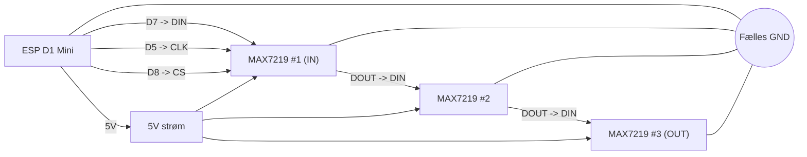

# W.O.P.R wiring diagram (ESP D1 Mini + 3x MAX7219 8x32)

Denne guide viser koblingen mellem din `ESP-D1-mini-USB-c.png` controller og 3 stk. MAX7219 8x32 paneler.

> Fra ESPHome config:
>
> - `CLK = D5`
> - `MOSI = D7`
> - `CS = D8`

## Controller reference

## Diagram

## Pin-til-pin (som på billed-wiring)

| ESP D1 Mini | MAX7219 (første modul / IN-side) |
|---|---|
| `5V` | `VCC` |
| `G` (GND) | `GND` |
| `D7` | `DIN` |
| `D5` | `CLK` |
| `D8` | `CS` / `LOAD` |

## Kæde for 3 moduler

1. ESP forbindes kun til **første** MAX7219 modul (IN-side).
2. `DOUT` fra modul #1 går til `DIN` på modul #2.
3. `DOUT` fra modul #2 går til `DIN` på modul #3.
4. `CLK`, `CS`, `VCC` og `GND` skal være fælles på alle 3 moduler.

## Koblingsliste

- `ESP D5 (GPIO14)` -> `CLK` på alle 3 moduler
- `ESP D7 (GPIO13)` -> `DIN` på modul #1
- `Modul #1 DOUT` -> `DIN` på modul #2
- `Modul #2 DOUT` -> `DIN` på modul #3
- `ESP D8 (GPIO15)` -> `CS/LOAD` på alle 3 moduler
- `5V` -> `VCC` på alle moduler
- `GND` (ESP + alle moduler + PSU) skal være fælles

## Vigtigt

- Start altid datakæden i den ende af første panel, der er mærket `DIN`/`IN`.
- Nogle MAX7219 boards kører fint med 3.3V logik fra ESP8266, men ved ustabil drift kan en 74HCT-level shifter forbedre signalet.