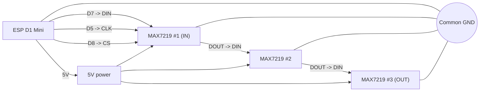

# W.O.P.R wiring diagram (ESP D1 Mini + 3x MAX7219 8x32)

This guide shows the wiring between your `ESP-D1-mini-USB-c.png` controller and 3x MAX7219 8x32 panels.

> From the ESPHome config:
>
> - `CLK = D5`
> - `MOSI = D7`
> - `CS = D8`

## Controller reference

## Diagram

## Pin-to-pin (like the wiring image)

| ESP D1 Mini | MAX7219 (first module / IN side) |
|---|---|
| `5V` | `VCC` |
| `G` (GND) | `GND` |
| `D7` | `DIN` |
| `D5` | `CLK` |
| `D8` | `CS` / `LOAD` |

## Daisy chain for 3 modules

1. Connect the ESP only to the **first** MAX7219 module (IN side).
2. Connect `DOUT` from module #1 to `DIN` on module #2.
3. Connect `DOUT` from module #2 to `DIN` on module #3.
4. `CLK`, `CS`, `VCC`, and `GND` must be shared across all 3 modules.

## Connection list

- `ESP D5 (GPIO14)` -> `CLK` on all 3 modules
- `ESP D7 (GPIO13)` -> `DIN` on module #1
- `Module #1 DOUT` -> `DIN` on module #2
- `Module #2 DOUT` -> `DIN` on module #3
- `ESP D8 (GPIO15)` -> `CS/LOAD` on all 3 modules
- `5V` -> `VCC` on all modules
- `GND` (ESP + all modules + PSU) must be common

## Important

- Always start the data chain from the side of the first panel marked `DIN`/`IN`.
- Many MAX7219 boards work with ESP8266 3.3V logic, but if you see unstable behavior, a 74HCT level shifter can improve signal reliability.